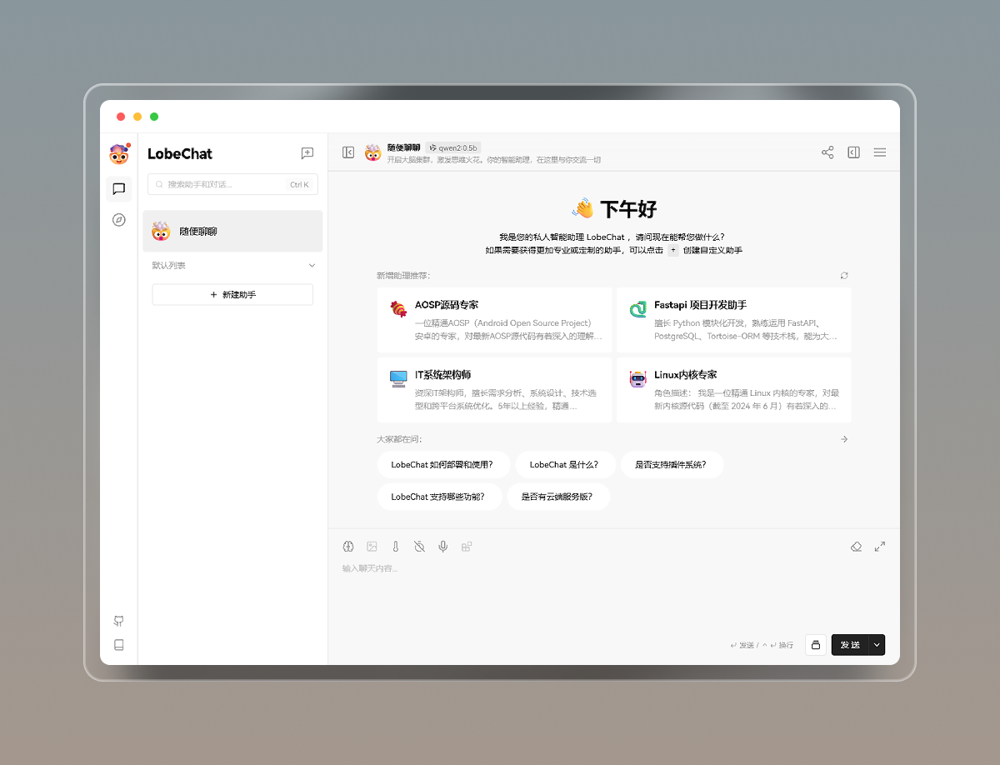
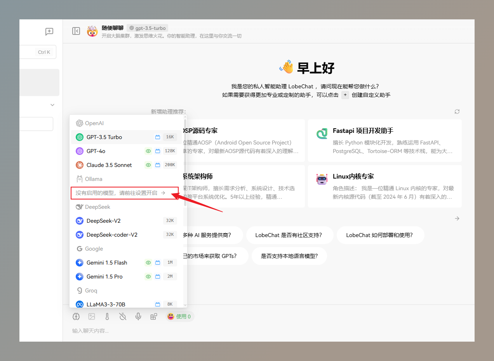
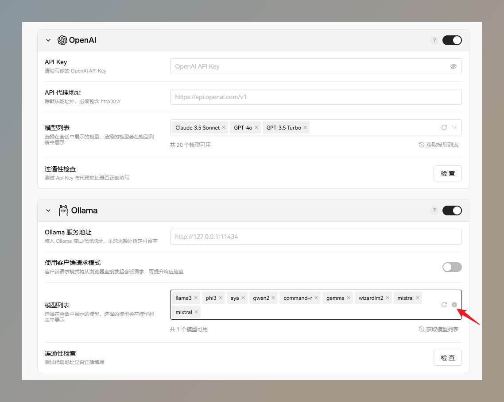
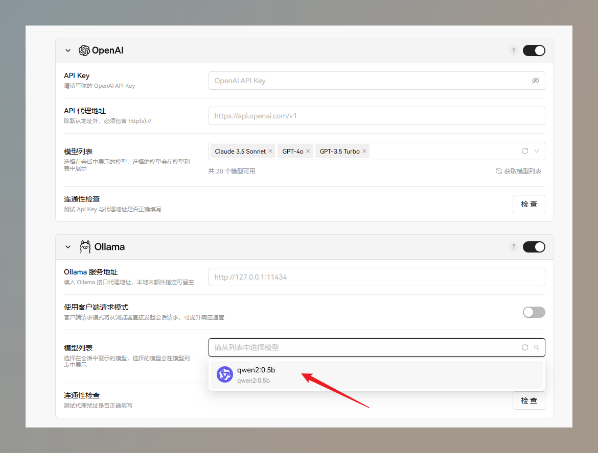

# AI Chat 体验

### 程序介绍

基于 LobeChat 部署的 AI Chat 体验程序，目前已经接入以下模型：

- OpenAI：GPT3.5、GPT4o
- Anthropic：Claude 3.5 Sonnet 
- DeepSeek：DeepSeek-V2、DeepSeek-coder-V2
- Google：Gemini 1.5 Flash、Gemini 1.5 Pro
- Groq：LLaMa3-3-70B、Mixtral-8x7b、Gemma-7b-it、LLaMa3-3-8B
- Ollama：qwen2:0.5b 【Ollama 基于私有服务器本地化部署的模型，服务器性能有限，只能运行此小模型了😅】

AI Chat 供临时体验。

访问地址：https://lobe.pmjojo.xyz

访问密码：pmjojo

 

### Ollama 使用教程

1.点击 Ollama 设置模型前往设置页。

 

2.点击【清空】按钮，清楚现有的所有模型。

 

3.选择【qwen2:0.5b】模型，然后回到聊天页面，选择该模型聊天。

